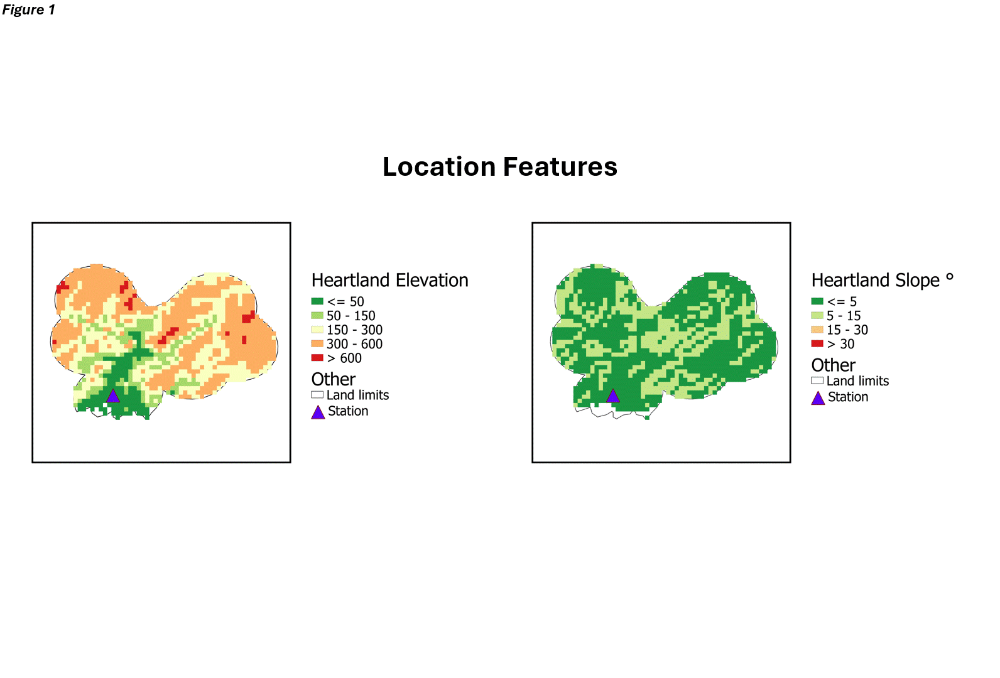

# Let's talk about Climate!
<div style="text-align: justify">

## Let me tell you a story... 

Once upon a time there was an "imaginary" place called "Heartland" that had an elevation below 700m and a predominantly flat terrain (figure 1). These conditions made it a pleasant place to live. However, over the course of a few decades, some things changed.

A meteorological station was installed to monitor the climate, and after processing the data, increases in temperature and strong precipitation peaks were observed during the same period (figure 2). These anomalies prompted comparisons with international methods for identifying "El Niño" and "La Niña" phenomena. While there was a slight resemblance to an "El Niño" event in the temperature increases, "Heartland" experienced atypical precipitation increases during the same period (figure 3).

Since these atypical behaviors couldn't be directly linked to ENSO phenomena, other variables were reviewed. It was found that radiation was higher in the second half of the year, vapor pressure followed a similar decadal trend, relative humidity was high in the middle of the year and low at the end, and wind speed was lower compared to its decadal trend (Figure 4).

These findings highlight how a set of variables evolves over time, emphasizing the ecosystem's vulnerability to small actions. Consequently, projections for 2024 and 2025 were generated using two methods: a Blackbox approach adjusting only some parameters (figure 5) and Deep Learning building a model part by part (Figure 6). Both models yielded similar projections, with a prolongation of the patterns described in Figure 4 (see figures 5 and 6).  Figure 7 was created to show this similarity between models using average, maximum and minimum temperatures.

Figure 8 compares the behavior of average temperature and precipitation at "Heartland" with its 2021-2040 projection according to a GCM (Global Climaate Model), validating and giving support "in a certain way" to those projections of Figures 5 and 6.

Now that we know how “alleged” human action can lead to significant changes, imagine being a resident of "Heartland", would you agree that by someone else's action, what you know can change from one day to the next? That the activity you like to do can no longer be done again or not in the place you frequent? Assuming that "Heartland" is our home and now that we know what climate conditions we are in and what awaits us, what would we want to talk about?
</div>

<br>




<div style="text-align: justify">

<br>


**This is a small sample of the application of data processing and data science techniques such as:**
1.  Data capture.
2. Cleaning and handling of outlier data
3. Matrix Operations
4. Data Visualization
5. Machine Learning
6. Deep Learning

    Just in this order...

<br>

Software used:
-	**Software GIS** 
-	**Python**

    _(it is recommended to use the latest versions)_

<br>

##### I'd like to express my gratitude to all those from whom I've learned something valuable.

<br>

"For those who are concerned about their environment and the conservation of biodiversity, if you like, I invite you to use a dataset of climatic variables, among others, of the place where you live and replicate this exercise, the results that can be found  could bring interesting ideas (*you can find climate data in database pages, in this same community or in repositories of international organizations*).

But more important than finding patterns and trends in the data, the objective of this exercise is to show that the climate is changing and there are things that are happening right now and the questions it leaves are: will we be a generation that will sit and watch through a screen, how our environment changes while what is vital to us and that was previously abundant is "monetized"? Or will we take action?

And remember, change isn't always bad. Sometimes, it's a chance to make things better. At this day, We've only got one planet, and it's up to us to decide what we do with it."
</div>

<div align="right">

### _**- 4sensesdev**_

</div>

<!-- 
Let's leave some code here!

```python

# Here I would place the code used for processing the data
# However, since the idea is for each user to generate their own results,
# I'll only include the necessary libraries.

# libraries
import pandas as pd  
import numpy as np 
import matplotlib.pyplot as plt

# you choose the library for models and error metrics

# Follow this steps

# start with 
data.describe()

# visualize trends and outliers

# generate mosaics

# operate data to calculate interesting things

# generate the models, make sure to split the data into training and test sets

# evaluate your models and generate short-term projections

# Visualize your results, are it consistent with observed data?

# now repeat all this for each variable

# enjoy the travel!
```
As I said on my profile front page, there may be hidden code only for those who know how to look/seek differently!
-->
